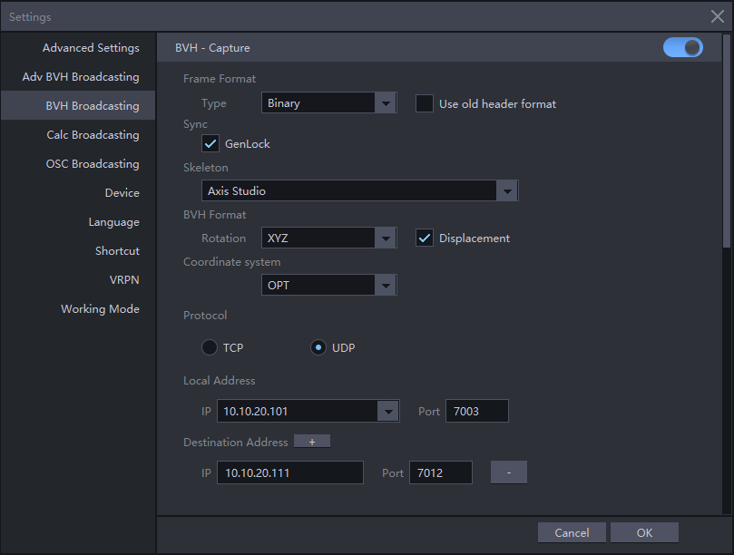

本工程演示了如何从Noitom公司提供的动捕设备获取数据，并通过MocapApi库获取数据，并操作axis studio进行开始录制和结束录制功能。

## 项目概述

本项目提供了一个命令行应用程序，用于控制Noitom动捕设备进行动作录制和停止操作。它基于MocapApi库与动捕设备通信，并通过键盘快捷键执行基本控制命令。

## 目录结构

```
.
├── MocapApi
│   ├── mocap_api
│   │   ├── __init__.py
│   │   ├── include
│   │   ├── lib
│   │   └── mocap_api.py
│   └── setup.py
├── img
│   ├── launch_axis_studio.gif
│   └── 其他图片资源
├── mocap_axis_command_demo.py
├── mocap_axis_cacl_demo.py
├── mocap_axis_demo.py
├── mocap_hds_demo.py
└── mocap_pnlink_command_demo.py
```

## 功能特性

- 键盘快捷键控制动捕设备
- 开始/停止动作录制功能
- 通过UDP协议与动捕服务端通信
- 实时状态信息显示和日志记录
- 错误处理机制
- 实时获取和显示骨骼数据

## 环境要求

- Python 3.x
- pynput库
- Noitom动捕设备及相关软件 (Axis Studio)

## 安装步骤

1. 确保已安装Python 3.x环境
2. 安装MocapApi库:
   
   ```bash
   cd MocapApi
   pip install -e .
   ```
3. 安装pynput库:
   
   ```bash
   pip install pynput
   ```
4. 确保动捕设备及相关软件已正确安装和配置

## 配置说明

在[mocap_axis_command_demo.py](mocap_axis_command_demo.py)文件中配置以下网络参数:

```python
settings.SetSettingsUDPEx('127.0.0.1', 7003)  # 客户端IP和端口
settings.SetSettingsUDPServer('127.0.0.1', 7012)  # 服务端IP和端口
```

请根据实际网络环境修改这些IP地址和端口号。

## Axis Studio配置

### 启动*Axis Studio*

确保Axis Studio软件已启动并正常运行。


### 配置 *BVH Broadcasting*

打开Axis Studio设置对话框，选择BVH Broadcasting并启用 BVH-Capture：

- Local Address: 填写运行Axis Studio软件的电脑IP
- Destination Address: 填写运行本程序的电脑IP



## 使用方法

直接运行演示程序:

```bash
python mocap_axis_command_demo.py
```

程序启动后，可以使用以下键盘快捷键:

- **S键**: 开始录制动作
- **P键**: 停止录制动作
- **ESC键**: 退出程序

## 核心功能

### 命令控制

程序通过`running_command`方法向动捕设备发送录制命令，支持开始录制(`CommandStartRecord`)和停止录制(`CommandStopRecord`)两种命令。

### 事件处理

程序通过异步事件循环处理以下事件类型:

- **AvatarUpdated**: 处理骨骼数据更新
- **Notify**: 处理系统通知
- **CommandReply**: 处理命令响应
- **RigidBodyUpdated**: 处理刚体更新

### 骨骼数据处理

程序会实时获取骨骼数据，包括关节名称、位置和旋转信息，并进行格式化输出。

## 工作原理

1. 程序启动时初始化MCPApplication并设置网络参数
2. 创建异步事件循环线程，持续监听UDP事件
3. 用户通过键盘快捷键发送开始/停止录制命令
4. 程序处理设备返回的状态信息和错误信息
5. 实时获取并显示骨骼数据信息
6. 所有状态信息通过日志系统记录和显示

## 注意事项

1. 使用前请确保动捕设备已正确连接并运行
2. 配置正确的服务端和客户端IP地址及端口
3. 确保防火墙允许UDP通信
4. 程序运行时不要关闭动捕设备软件
