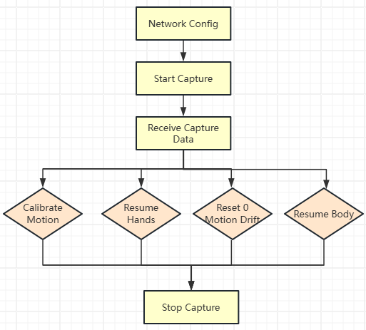
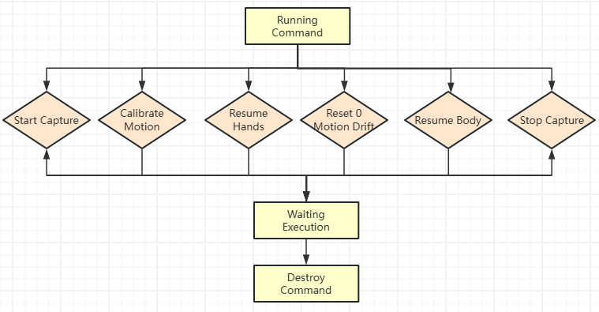
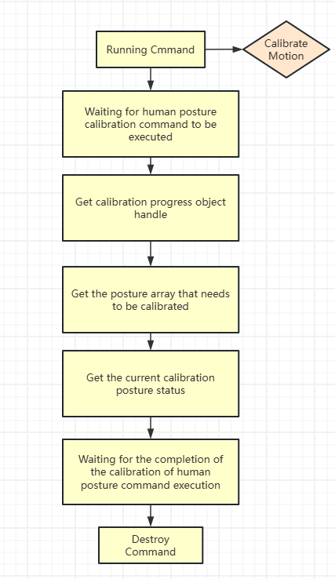

# PN-Link Python操作文档

## 一、产品与工程介绍

### 关于 PN-Link

PN-Link 是诺亦腾公司推出的全身有线惯性动作捕捉产品，其工作原理为：身体各子节点的数据通过有线方式汇总至背部主节点，最终经网络传输至上位机。

相较于其他无线惯性动捕产品，PN-Link 的核心优势在于支持**直连模式**：无需安装诺亦腾上位机软件 Axis Studio，可通过 MocapApi SDK 直接连接主节点，完成数据采集、人体姿态校准等核心操作。

### 关于本工程

本工程演示了如何通过 Python WebUI 调用 MocapApi SDK 直连 PN-Link 主节点，实现上述数据采集、姿态校准等功能，为开发者提供直观的操作示例。

## 二、环境要求

运行本工程需满足以下环境条件：

- 编程语言：Python 3.x 及以上版本
- 依赖库：需安装`nicegui`（可通过`pip install nicegui==2.24.1`完成）
- 浏览器：需支持 OpenGL 的现代浏览器（如 Chrome、Microsoft Edge 等）
- 硬件设备：PN-Link 有线动捕套装

## 三、网络配置

### 基础配置说明

PN-Link 主节点默认参数如下：

- 固定 IP：`10.42.0.202`
- 监听 UDP 端口：`8080`

**主机配置要求**：需将运行工程脚本的机器 IP 设置为同网段（如`10.42.0.101`），确保设备与主机处于同一局域网。

### 核心网络参数

| 角色       | 默认 IP 地址      | 默认 UDP 端口 |
| -------- | ------------- | --------- |
| 客户端（主机）  | `10.42.0.101` | `8002`    |
| 服务器（主节点） | `10.42.0.202` | `8080`    |

### 配置修改方式

- 旋转顺序默认设为 XYZ，如需调整可通过配置文件修改

- IP 地址、端口等参数可通过修改`web_config.py`文件调整，关键配置如下：
  
  ```python
  # web_config.py
  SERVER_IP = '10.42.0.202'    # 主节点IP
  SERVER_PORT = 8080           # 主节点端口
  CLIENT_IP = '10.42.0.101'    # 主机IP
  CLIENT_PORT = 8002           # 主机端口
  BVH_HEADER_FILE = "config/bvh_header.json"
  WEB_THREE_HTML = 'web/three_fbx_viewer.html'
  ```

- 代码中参数初始化逻辑（`mocap_control.py`）：
  
  ```python
  # mocap_control.py
  class MCPControl:
      def __init__(self, msg_queue: multiprocessing.Queue = None):
          # 初始化应用与配置
          self.app = MCPApplication()
          settings = MCPSettings()
  
          # 配置BVH数据格式与转换
          settings.set_bvh_data(MCPBvhData.Binary)
          settings.set_bvh_transformation(MCPBvhDisplacement.Enable)
          settings.set_bvh_rotation(MCPBvhRotation.XYZ)  # 旋转顺序设为XYZ
  
          # 配置UDP传输参数
          settings.SetSettingsUDPEx(CLIENT_IP, CLIENT_PORT)
          settings.SetSettingsUDPServer(SERVER_IP, SERVER_PORT)
  ```

## 四、启动 Web 服务器

### 启动步骤

1. 打开终端，进入工程目录：
   
   bash
   
   ```bash
   cd python_webui
   ```

2. 启动 Web 服务器：
   
   bash
   
   ```bash
   python web_ui.py
   ```

3. 打开浏览器，访问地址：[http://localhost:8080](http://localhost:8080/)


## 五、指令说明

### 指令执行顺序

需按以下流程执行指令：

1. 创建网络链接
2. 执行采集指令
3. 输出采集数据
4. 执行其他指令（如校准）
5. 停止采集



### 指令执行流程

单条指令的生命周期：

1. 创建指令
2. 执行指令
3. 等待指令执行完成
4. 销毁指令



### 校准流程



## 六、操作流程

### 1. 连接 PN-Link 设备

1. 确保主机与 PN-Link 主节点网络配置正确（同网段）
2. 打开浏览器访问[http://localhost:8080](http://localhost:8080/)
3. 状态栏显示为**绿色 “已连接”**，表示连接成功

### 2. 开始捕捉（Start Capture）

1. 点击页面中的 “Start Capture” 按钮
2. 保持站立或坐姿**15 秒**完成初始化（建议额外等待 10 秒以优化效果）
3. 初始化完成后，设备开始实时捕捉动作数据

### 3. 校准（Calibrate）

1. 点击 “Calibrate” 按钮
2. 按照页面提示依次完成以下姿态：
   - VB-Pose
   - P-Pose
   - T-Pose
   - A-Pose
   - F-Pose
3. 所有姿态完成后开始计算校准结果(等待1-3分钟)，页面显示 “Mocap 校准完成！”，表示校准成功

### 4. 其他核心操作

- **恢复手势（Resume Hands）**：点击按钮可恢复手势捕捉功能
- **重置零点漂移（Reset 0 Motion Drift）**：点击按钮清除运动漂移误差
- **恢复身体姿态（Resume Body）**：点击按钮重置身体姿态基准
- **零点校准（Zero Position）**：点击按钮将当前位置设为姿态零点
- **停止捕捉（Stop Capture）**：点击按钮停止动作数据采集


### 5. 3D 数据输出切换

点击 “切换数据输出” 按钮可在两种模式间切换：

- **3D Data**：输出完整骨骼位置与旋转数据，支持浏览器 3D 实时可视化
- **Joint Data**：输出关节角度信息

### 6. 设备配置（PN-Link 设置）

点击 “PN-Link 设置” 按钮打开配置页面，可调整以下参数：

- IP 地址与端口号
- 数据传输格式
- 骨骼旋转顺序
  
  

## 七、常见问题解决

### 1. 连接失败

- 检查主机与 PN-Link 主节点 IP 是否在同网段（如`10.42.0.x`）
- 确认端口未被占用（默认客户端 8002、服务器 8080）
- 重启 PN-Link 设备与 Web 服务器后重试

### 2. 校准失败

- 确保初始化阶段（Start Capture 后）保持姿态稳定达 15 秒以上
- 检查旋转顺序配置是否与设备默认（XYZ）一致
- 重启设备并重新执行校准流程
  
  

## 八、系统关闭

为避免数据丢失或设备异常，建议按以下步骤关闭系统：

1. 点击 “Stop Capture” 按钮停止动作捕捉
2. 关闭 Web 浏览器
3. 在终端按`Ctrl+C`停止 Web 服务器
